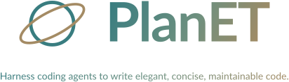
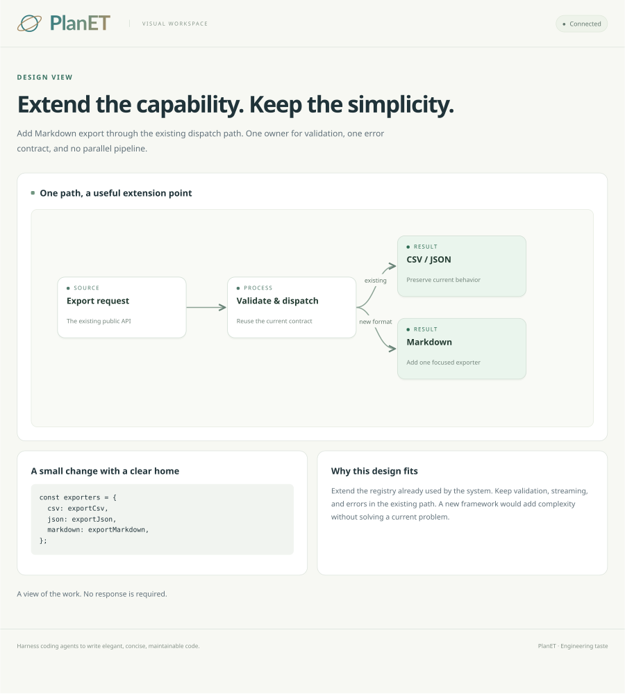
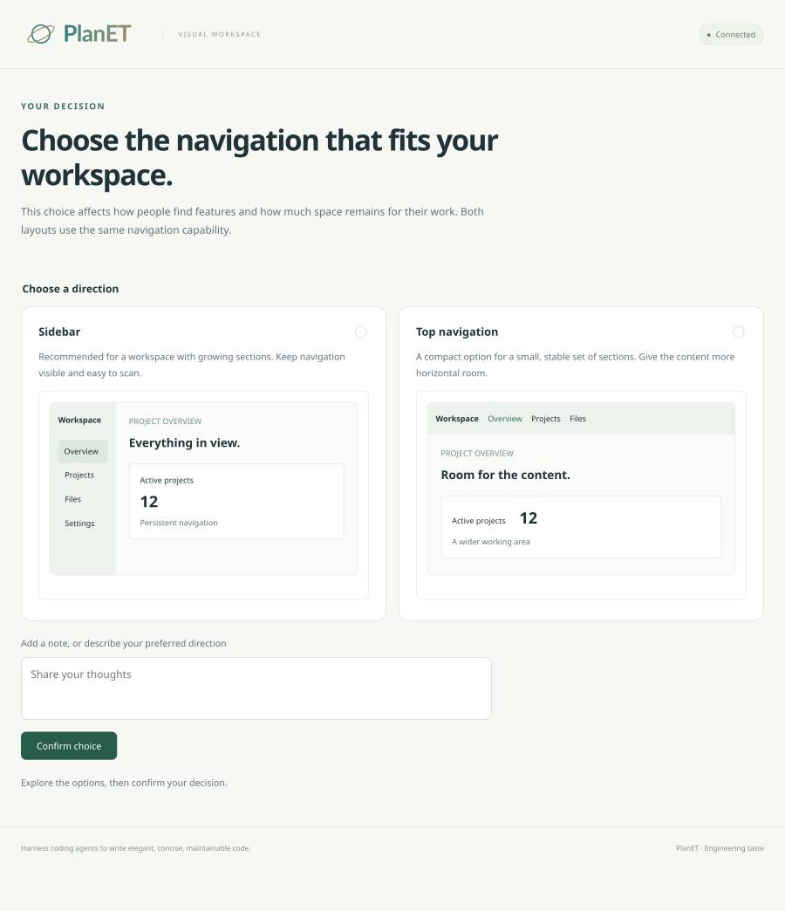

<p align="center">
  
</p>

Software development is a systems engineering discipline. Aligning requirements is essential, but it is not enough: AI-generated code can still be cluttered, overengineered, and difficult to maintain.

Tools such as Superpowers bring useful discipline to agent workflows. PlanET focuses on the engineering judgment inside that work: choosing suitable design patterns, extending existing capabilities, keeping related logic together, and removing unnecessary complexity. Agents should own routine technical decisions and ask users only necessary, consequential questions.

PlanET is an engineering harness for **Claude Code, Codex, and Pi**, delivered as a plugin with one shared set of engineering principles and an optional local visual workspace. It is designed for everyday coding: straightforward installation, ordinary task requests, and decisions that stay grounded in the existing codebase.

## Installation

Requires **Node.js 22+**, **Git**, and one of the supported coding agents. Install directly from [ecstayalive/PlanET](https://github.com/ecstayalive/PlanET); you do not need to clone the repository or run `npm install` first.

### Claude Code

Run these commands **inside a Claude Code session**:

```text
/plugin marketplace add ecstayalive/PlanET
/plugin install planet@planet
```

Start a new session after installation. [Claude Code installation reference](https://code.claude.com/docs/en/discover-plugins).

### Codex

Run these commands **in your terminal**:

```sh
codex plugin marketplace add ecstayalive/PlanET
codex plugin add planet@planet
```

Start a new session after installation. If your Codex version does not provide `plugin add`, update it or install PlanET from the added marketplace in the desktop client's Plugins directory. [OpenAI Docs: plugin marketplaces](https://developers.openai.com/plugins/build/plugins).

### Pi

Run this command **in your terminal**:

```sh
pi install git:github.com/ecstayalive/PlanET
```

Start a new Pi session after installation. [Pi package installation reference](https://github.com/earendil-works/pi/blob/main/packages/coding-agent/docs/packages.md).

### Use PlanET

Use your agent normally after installation. With startup loading enabled, PlanET's engineering guidance applies to coding tasks automatically. You can also ask the agent to apply PlanET to an implementation, refactor, or code review. For explicit invocation:

| Agent | Engineering skill | Visual workspace |
| --- | --- | --- |
| Claude Code | `/planet:planet` | `/planet:planet-visual` |
| Codex | `$planet:planet` | `$planet:planet-visual` |
| Pi | `/skill:planet` | `/skill:planet-visual` |

The agent inspects the existing implementation, chooses the simplest suitable design, implements the change, simplifies it, and verifies the result. It asks about consequential ambiguity and uses the visual workspace when seeing a design helps.

For example: **“Add Markdown export using the existing export pipeline.”** PlanET guides the agent to find the current implementation, preserve its contracts, and extend it with a focused change. To inspect the design, add **“Show how the new exporter fits into the existing flow.”**

In Codex, you can also select either skill from the skill picker. Automatic startup loading depends on host hook support and trust settings; explicit skills remain available when hooks are disabled. PlanET has no cloud backend, telemetry, or runtime dependencies. Model inference is handled by your coding agent.

## Principles

1. **Choose suitable, elegant design patterns.** Use established patterns when they solve a real problem, with the simplest structure that does the job.
2. **Keep related logic together.** Inline short, meaningless wrappers with one or two callers. Retain abstractions that express domain rules, meaningful reuse, external boundaries, or lifecycle ownership.
3. **Extend before replacing.** Find and extend the existing implementation and its extension points instead of building parallel versions of the same feature.
4. **Think in systems.** Consider responsibility, dependencies, state, failures, compatibility, and the practical cost of the next change.
5. **Minimize interruption.** Inspect repository facts and make ordinary engineering decisions independently. Ask about consequential ambiguity, not routine details.
6. **Name things by their role.** Use concise, conventional domain names. Avoid meaningless numeric suffixes, generator signatures, and temporary labels; preserve meaningful names such as `sha256`, `http2`, and real protocol versions.

The policy lives in [the PlanET skill](skills/planet/SKILL.md). Host adapters load that same policy instead of maintaining separate versions. Naming guidance does not claim to modify hidden model internals or remove upstream attribution.

The principles are language-agnostic. Your agent uses the repository's existing compiler, test runner, formatter, and conventions; PlanET provides engineering guidance rather than a language-specific toolchain.

## Pi prompt-prefix stability

PlanET snapshots its shared instructions once when the extension loads. In current Pi, it contributes one stable `planet` system-prompt section, leaving the host's existing sections and tools intact. Repeated turns use identical content and ordering; an unchanged section produces no new section delta. After compaction, the same section is restored. Reload the extension to adopt policy edits.

For older Pi, or a prompt forced by another extension, PlanET appends the same stable text to the existing prompt and avoids duplicate appends. It never inserts synthetic user messages into conversation history, prepends changing instructions, or injects session IDs, timestamps, screen content, or progress into the prefix.

This avoids cache invalidation caused by PlanET itself. Actual cache hits still depend on the provider, model, cache lifetime, other extensions, tools, and history; the plugin cannot promise a cache-hit percentage.

## Visual workspace

Show architecture, compare designs, and preview results in a focused browser UI. Flowcharts use clear hierarchy, descriptive nodes, readable connectors, and a consistent visual system. Screens distinguish **views** from **decisions**:

- A **view** explains a design or shows a result while authorized work continues. The example below maps the existing export path and its Markdown extension, with the proposed implementation and design rationale alongside it.



- A **decision** requests a consequential choice and records it only after explicit confirmation. The example below compares two navigation layouts. Neither option is preselected; choose a direction or write a response, then confirm it.



Ask the agent to show a design or comparison, then open the local link it shares. The agent prepares and updates the visual workspace. A view needs no reply. For a decision, review the alternatives, confirm your choice, and return to the conversation to continue.

The workspace runs locally and supports architecture diagrams, code previews, UI comparisons, and written feedback. Confirmed decisions survive a page refresh. If a local browser is unavailable, the agent can explain the design in the conversation or share a static preview.

## Identity and terminal display

The identity pairs a simple orbital mark with the **PlanET** wordmark. The name and capitalization carry the identity even when color and graphics are unavailable. All image assets are SVG. The README centers a self-contained, transparent SVG banner with a tightly fitted canvas. Terminal output uses text or a tiled wordmark.

- [Light logo](skills/planet-visual/public/logo.svg), [dark logo](assets/logo-dark.svg), and [monochrome logo](assets/logo-mono.svg).
- [Standalone icon](assets/icon.svg) and [monochrome icon](assets/icon-mono.svg).
- [Brand guide and preview](assets/README.md).

```sh
node scripts/logo.mjs                 # Compact wordmark; color on a capable TTY
node scripts/logo.mjs --banner        # Optional seven-row color-block banner
node scripts/logo.mjs --no-color      # Plain text
node scripts/logo.mjs --color         # Explicit ANSI color for a preview
```

The renderer respects `NO_COLOR`, `TERM=dumb`, redirected output, and narrow TTYs. True-color terminals use a coordinated three-color palette; 256-color and basic ANSI terminals receive the closest available treatment. Colored banners use background-colored spaces; without color, solid Unicode blocks preserve the letterforms. Dumb terminals use plain `PlanET`. No special font or image protocol is required. Display is opt-in and never enters agent prompts or startup output.

## Development and verification

Clone the repository:

```sh
git clone https://github.com/ecstayalive/PlanET.git
cd PlanET
```

Try the checkout for one session with `claude --plugin-dir .` or `pi -e .`. For Codex, use `codex plugin marketplace add .`, then `codex plugin add planet@planet` and start a new session.

To use only the skills, copy the complete `skills/planet` and `skills/planet-visual` directories into your agent's skills directory. This does not install the startup adapters; standalone Codex names are `$planet` and `$planet-visual`.

No `npm install` is needed. Run the checks:

```sh
npm run check
npm test
claude plugin validate --strict .claude-plugin/plugin.json
claude plugin validate --strict .claude-plugin/marketplace.json
```

Checks cover package metadata, skill references, script syntax, host adapters, and visual protocol invariants. [Behavioral evaluations](evals/README.md) assess engineering judgment separately; a valid package does not prove the model will always follow its instructions or produce elegant code.
